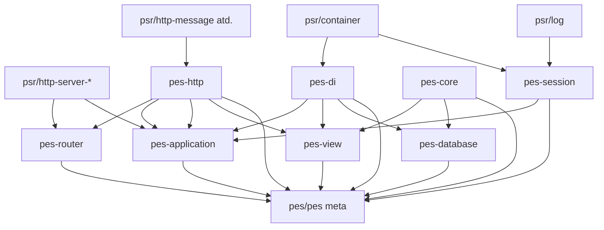

# Rozdělení monorepa `pes/pes` na Composer balíčky

Aktualizovaný plán po přesunech: `Pes\Core\*`, `Pes\Application\*` + middleware, `Pes\View\Dom\*`, `pes/pes-session` jako samostatný path balíček.

**Provedený stav:** zdrojáky jsou přesunuty do `pes-session/`, `pes-core/`, `pes-http/`, `pes-di/`, `pes-router/`, `pes-database/`, `pes-view/`, `pes-application/`. Kořenový `pes/pes` je závislý na všech těchto balíčcích (`@dev`) a jeho `autoload.psr-4` mapuje už jen zbývající namespace v `src/` (`Acl`, `Comparator`, `Document`, …), aby nedocházelo ke kolizi s balíčky.

## Cílové balíčky (kromě meta `pes/pes`)

| Balíček | Namespace (PSR-4) | Zdrojová složka po extrakci | Poznámka |
|---------|---------------------|-----------------------------|----------|
| `pes/pes-session` | `Pes\Session\` | `pes-session/src/` | Hotovo |
| `pes/pes-http` | `Pes\Http\` | `pes-http/src/` | Hotovo |
| `pes/pes-di` | `Pes\Container\` (+ případně `Pes\Config\`, `Pes\Autoloader\`) | `pes-di/src/` | Hotovo (`Config` / `Autoloader` zatím v meta `src/`) |
| `pes/pes-core` | `Pes\Core\` | `pes-core/src/` | Hotovo |
| `pes/pes-router` | `Pes\Router\` | `pes-router/src/` | Hotovo |
| `pes/pes-database` | `Pes\Database\`, `Pes\Query\` | `pes-database/src/` | Hotovo |
| `pes/pes-view` | `Pes\View\` | `pes-view/src/` | Hotovo |
| `pes/pes-application` | `Pes\Application\` | `pes-application/src/` | Hotovo |
| `pes/pes` (meta) | zbývající `Pes\*` | `src/` | PSR-4 jen pro nesloučené stromy |

**Zatím mimo tabulku** (další vlna nebo součást meta): `Acl`, `Autoloader`, `Bootstrap`, `Comparator`, `Config`, `Debug`, `Document`, `Entity`, `Logger`, `Readers`, `Repository`, `Slot`, `Storage`, `Utils`.

## Závislosti (logický DAG)

## Doporučené pořadí extrakce

1. **pes-http** — málo vnitřních závislostí na zbytek Pesu; ostatní je na něj napojené.
2. **pes-di** — čistý `Pes\Container\*` (+ volitelně `Config` / `Autoloader` po analýze importů).
3. **pes-core** — ověřit odkazy z `pes-session` na `Pes\Core\Security` (už v suggest).
4. **pes-router** — odstranit zbytky vazeb na legacy `Pes\Action` (již částečně hotovo).
5. **pes-database** — `Database`, `Query`; doplnit `require` podle reálných `use` (např. `Pes\Core`, `Psr\Log`).
6. **pes-view** — přesun `src/View/**/*`; namespace už `Pes\View\…` včetně `Pes\View\Dom\…`.
7. **pes-application** — závisí na http, di, session; middleware zůstává v `Pes\Application\Middleware`.
8. **Root `pes/pes`** — postupně ztenčit `src/` na „zbytek“ nebo rozšířit o další balíčky.

## Kroky při dalším vývoji balíčku

1. Upravovat kód primárně v příslušném `pes-*/src/` (ne v odstraněných cestách pod `src/`).
2. Doplňovat `require` v `composer.json` daného balíčku podle nových `use` vazeb.
3. Po změně závislostí v meta projektu: `composer update` v kořeni.

## Balíčky v repozitáři

Adresáře `pes-*` obsahují přesunutý kód a vlastní `composer.json`. Kořenový `pes/pes` je na ně závislý (`@dev`) a `repositories` používají `path` + `symlink: true`.

## `pes-session` a `pes-application`

- `SessionServicesConfigurator` žije v `Pes\Application` a potřebuje `pes/pes-session` + kontejner (`ContainerSettingsAwareInterface`).
- Šifrované save handlery v session dál suggestují `pes/pes-core` kvůli `Pes\Core\Security\Cryptor`.

## Kontrola po extrakci

- Žádné duplicitní stromy (`src/Dom` vs `src/View/Dom`) — ponechat jen kanonickou cestu odpovídající namespace.
- `composer dump-autoload -o` a oprava PSR-4 varování v rootu i v balíčcích.
